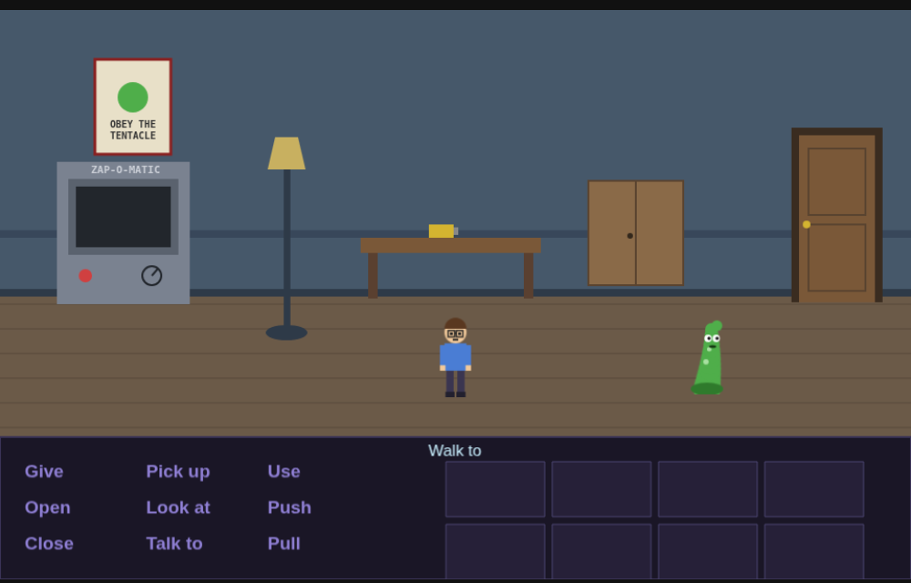

# Click-o-mat — Point-and-Click Adventure Engine (Phaser 4)

A SCUMM-style point-and-click adventure engine — everything you need to build
something in the spirit of *Day of the Tentacle*. Written in TypeScript on
[Phaser 4](https://phaser.io/), with a small data-driven content layer so you
describe rooms, items, and dialog as plain objects rather than wiring up scenes
by hand.

The repo ships with a short, fully playable demo ("Ned the Tentacle") that
exercises every feature. All character art, icons, and sound in the demo are
generated procedurally at runtime, so there are **no binary assets** — the whole
thing is code.

### ▶ [Play the demo in your browser](https://timosachsenberg.github.io/click-o-mat/)

[](https://timosachsenberg.github.io/click-o-mat/)

---

## Getting started

### Requirements

- **Node.js 18 or newer** (developed on Node 24). Check with `node --version`.
- npm (bundled with Node). No global installs needed.

### 1. Install dependencies

```bash
npm install
```

This pulls in Phaser 4, Vite, and TypeScript into `node_modules/` (git-ignored).

### 2. Start the dev server

```bash
npm run dev
```

Vite prints a local URL — open it in your browser:

```
  ➜  Local:   http://localhost:5173/
```

The server hot-reloads: edit any file under `src/` and the game refreshes
automatically. Stop it with `Ctrl-C`.

> **On WSL / a VM?** If `localhost` doesn't resolve from your Windows browser,
> run `npm run dev -- --host` and use the printed **Network** URL
> (e.g. `http://172.22.x.x:5173/`) instead.

### 3. Build for production

```bash
npm run build     # type-checks with tsc, then bundles to dist/
npm run preview   # serve the built dist/ locally to sanity-check it
```

`dist/` is a static site — drop it on any static host (GitHub Pages, Netlify,
S3, itch.io, …). `vite.config.ts` sets `base: './'` so it works from any
subpath.

### Controls

| Action | Input |
| --- | --- |
| Walk | **Left-click** the floor |
| Run | **Double-click** while walking (fast walk — triggers still fire) |
| Smart action | **Left-click a hotspot** with no verb selected: performs its default (open the door, pick the thing up, talk) |
| Perform a specific verb | **Left-click a verb** (or hotkeys **Q W E / A S D / Z X C**), then click the target |
| Default verb, explicitly | **Right-click** a hotspot |
| Reveal hotspots | Hold **Tab** — name labels over everything interactive |
| Use / combine items | **Click an inventory item** to arm it, then click a hotspot ("Use X with…") or another item (combine); **right-click an item** to look at it; **mouse wheel** pages the inventory |
| Choose a dialog line | **Click** the line; long menus paginate (**"▾ More choices"** or mouse wheel); click anywhere to **skip** speech |
| Quick save / load | **F5** / **F9** (the QUICK slot) |
| Save slots | **⚙ options menu**: 4 slots showing room + time; Save/Load/✕ per slot, with inline confirmation before overwriting or deleting |
| Skip a cutscene | **Esc** (fast-forwards to the end; stops at dialog choices) |
| Options menu | **⚙ button** (top-right): volume sliders, mute, save slots — **Esc** closes |
| Mute / unmute audio | **M**, or the 🔊 button (top-right) |
| Debug overlay | **F1** (draws walk area, obstacles, hotspots) |

### Playing the demo

Bring Ned the Tentacle something *warm, fuzzy, and radioactive*:

1. Take the **battery** off the lab table.
2. Go through the right-hand **door** to the hallway; **push** the ficus aside
   to uncover a **key**.
3. Back in the lab, **use the key** on the cabinet to free a **hamster**.
4. **Use the battery** on the Zap-O-Matic to power it, then **use the hamster**
   on it to irradiate him into a *glowing hamster*.
5. **Give the glowing hamster** to Ned. Roll credits.

Also try just **talking to Ned** (right-click him) to see the dialog tree, and
step through the hallway's **GALLERY** door to visit a room built from PNG art
(a PNG background, the spritesheet critter Blobbo, animated sconces, and a
foreground pillar). Through the gallery's **archway** lies the Grand Staircase —
a two-story scrolling room; walk up the stairs and watch the camera follow and
the banister slide in front of you. Finally, the staircase's **front door
(marked OUT)** leads outside: climb the mountain's switchback trail and watch
yourself shrink into the distance, birds cross the sky, cloud shadows drift
over the meadow, and — from the summit — **look at the view** for a full
zoom-out. From the meadow's **edge of the woods** (far right), step into the
**Whispering Wood** — a stormy forest with falling rain, lightning, and thunder.

---

## Tutorial: build your first room

This walks through adding a brand-new room — a small **closet** — reachable
from the demo's lab. You'll touch a background, a walkable floor, a hotspot, an
item, and a room-to-room door. It assumes `npm run dev` is running so you can
watch each change live.

Everything you edit lives under `src/game/`. You never need to touch
`src/engine/`.

### Step 1 — Create the room file

Create `src/game/rooms/closet.ts`:

```ts
import { Layer, type RoomDef } from '../../engine/types';

export const closetRoom: RoomDef = {
  id: 'closet',
  name: 'Broom Closet',

  // A room is a stack of layers. This one only needs a backdrop, painted
  // into a 960×450 canvas. `state` lets you draw conditionally; this room
  // is static so we ignore it.
  layers: [
    {
      id: 'bg',
      depth: Layer.BEHIND,
      paint(g, _state) {
        g.fillStyle = '#2b2440';         // back wall
        g.fillRect(0, 0, 960, 300);
        g.fillStyle = '#4a3d2e';         // floor
        g.fillRect(0, 300, 960, 150);

        // A shelf on the back wall
        g.fillStyle = '#6b5638';
        g.fillRect(360, 150, 240, 14);
      },
    },
  ],

  // The walkable floor, as a polygon in room coordinates (0,0 = top-left).
  walkArea: [
    { x: 60, y: 312 },
    { x: 900, y: 312 },
    { x: 920, y: 445 },
    { x: 40, y: 445 },
  ],

  // Actors shrink toward the back wall for a fake-perspective look.
  scaling: { yTop: 312, scaleTop: 0.72, yBottom: 445, scaleBottom: 1.05 },

  // Named spawn points. goToRoom('closet', 'fromLab') drops the player here.
  entries: {
    fromLab: { x: 120, y: 400, facing: 'right' },
  },

  hotspots: [
    // We'll add hotspots in the next steps.
  ],
};
```

### Step 2 — Register the room

Open `src/game/index.ts` and add the room to the `rooms` map:

```ts
import { closetRoom } from './rooms/closet';

export const CONTENT: GameContent = {
  rooms: {
    lab: labRoom,
    hallway: hallwayRoom,
    closet: closetRoom,          // <-- add this
  },
  // ...unchanged
};
```

The room now exists, but nothing leads to it yet.

### Step 3 — Add a door out (and back)

A door is just a hotspot whose handler calls `ctx.goToRoom(...)`. Add this to
the closet's `hotspots` array so you can get back to the lab:

```ts
{
  id: 'closet-exit',
  name: 'door',
  rect: { x: 20, y: 130, w: 90, h: 180 },  // clickable region
  walkTo: { x: 120, y: 400 },              // player walks here first
  facing: 'left',
  defaultVerb: 'open',                     // used on right-click
  on: {
    lookat: 'The door back to the lab.',
    open: async (ctx) => {
      ctx.sfx('open');
      await ctx.goToRoom('lab', 'fromHallway');
    },
  },
},
```

Now wire a door **into** the closet from the lab. Open
`src/game/rooms/lab.ts` and add a hotspot to its `hotspots` array (put it
anywhere in the room art you like — here it reuses the poster's wall):

```ts
{
  id: 'closet-door',
  name: 'closet door',
  rect: { x: 210, y: 60, w: 60, h: 120 },
  walkTo: { x: 240, y: 330 },
  facing: 'up',
  defaultVerb: 'open',
  on: {
    lookat: 'A narrow door. Probably a closet.',
    open: async (ctx) => {
      ctx.sfx('open');
      await ctx.goToRoom('closet', 'fromLab');
    },
  },
},
```

Save, then in the lab **right-click** that spot — you should fade into the
closet, and the closet door takes you back. Press **F1** in either room to see
the walk area (green), obstacles (red), and hotspot boxes (yellow) — invaluable
while placing `rect` and `walkTo` coordinates.

### Step 4 — Add an item to pick up

Let's put a **flashlight** on the shelf. First define the item in
`src/game/items.ts`:

```ts
flashlight: {
  id: 'flashlight',
  name: 'flashlight',
  icon: 'icon-key',   // reuse an existing icon for now (see note below)
  lookAt: 'A heavy flashlight. The batteries feel dead.',
},
```

Then add a hotspot for it in the closet. Note the `visible` guard and the
`batteryTaken`-style flag so it disappears once taken:

```ts
{
  id: 'flashlight',
  name: 'flashlight',
  rect: { x: 430, y: 118, w: 80, h: 36 },
  walkTo: { x: 470, y: 330 },
  facing: 'up',
  defaultVerb: 'pickup',
  visible: (state) => !state.getFlag('flashlightTaken'),
  on: {
    lookat: 'A flashlight, sitting on the shelf.',
    pickup: async (ctx) => {
      ctx.setFlag('flashlightTaken');   // remember it's gone
      ctx.addItem('flashlight');        // add to inventory (plays a jingle + toast)
      ctx.repaint();                     // redraw so any state-based art updates
    },
  },
},
```

Right-click the flashlight — it jumps into your inventory and the hotspot
vanishes (because `visible` now returns false). Click it in the inventory to
arm it, and you'll see "Use flashlight with…" in the sentence line.

> **About the icon:** icons are texture keys generated in
> `src/engine/BootScene.ts` (`makeIcons()`). To give the flashlight its own
> icon, add a `makeCanvasTex(this, 'icon-flashlight', 64, 48, (g) => { ... })`
> block there and set `icon: 'icon-flashlight'`. Until then, reusing an
> existing key like `icon-key` is fine.

### Step 5 — React to using one item on another

Suppose the flashlight needs the demo's battery. Give the flashlight a
`combine` entry (also in `items.ts`):

```ts
flashlight: {
  id: 'flashlight',
  name: 'flashlight',
  icon: 'icon-key',
  lookAt: 'A heavy flashlight. The batteries feel dead.',
  combine: {
    // Triggered by "Use battery with flashlight" (or the reverse)
    battery: async (ctx) => {
      if (!ctx.hasItem('battery')) return;
      ctx.removeItem('battery');
      ctx.sfx('pickup');
      await ctx.playerSay('Click. Now it works. Science!');
      ctx.setFlag('flashlightOn');
    },
  },
},
```

In-game: pick up the battery in the lab, pick up the flashlight in the closet,
then click one item in the inventory and the other to combine them.

That's the whole loop — **draw a room, register it, connect it with doors, add
hotspots and items, and script reactions.** Everything else in the engine
(pathfinding, animation, dialog, save/load) is automatic.

### Where to go next

- **Talkable NPCs:** add an actor in `actors.ts`, place it via the room's
  `actors: [{ id, x, y }]`, and give a hotspot a `talkto` handler that calls
  `ctx.dialog('your-dialog-id')`. Define the tree in `dialogs.ts`.
- **Cutscenes:** a room's `onEnter` script (or any handler) can `await`
  `ctx.walkTo`, `ctx.say`, `ctx.wait`, `ctx.flash`, `ctx.shake`,
  `ctx.showTitle`, etc. — see the full API below.
- **Conditional art:** because `paint`/`walkArea`/`holes` receive `state`, you
  can open doors, move furniture, or reveal items by flipping a flag and calling
  `ctx.repaint()`. See how the lab cabinet and hallway plant do it.

---

## Feature checklist

| Feature | Where |
| --- | --- |
| Nine-verb interface (Give, Pick up, Use, Open, Look at, Push, Close, Talk to, Pull) | `engine/verbs.ts`, `engine/UIScene.ts` |
| Sentence line ("Use battery with Zap-O-Matic") | `engine/UIScene.ts` |
| Left-click walk / right-click default verb | `engine/RoomScene.ts` |
| Walkable-area pathfinding around obstacles (visibility graph + Dijkstra) | `engine/Pathfinder.ts` |
| Directional walk / idle / talk character animations | `engine/Actor.ts`, `engine/BootScene.ts` |
| Perspective scaling (actors shrink toward the back wall) | `engine/Actor.ts` |
| **Layer system** — backdrops, occluders (walk-behinds), foreground overlays, animated layers, one shared depth axis | `engine/types.ts`, `engine/RoomScene.ts` |
| **Scrolling rooms** — rooms larger than the screen, camera follows the player (both axes), per-layer parallax | `engine/RoomScene.ts` |
| **Ambient events** — recurring non-blocking background activity (birds, shadows, weather: rain + lightning + thunder) | `engine/RoomScene.ts` |
| **Regions** — walk-on/walk-off triggers with once + conditions | `engine/RoomScene.ts` |
| **NPC hotspots** — clickable areas that follow moving actors | `engine/RoomScene.ts` |
| **Multiple playable characters** (optional) — switchable party, per-character inventory, item passing, parked companions | `engine/GameState.ts`, `engine/Engine.ts` |
| **Cutscene skipping** — Esc fast-forwards say/wait/walk/tween/zoom to the end | `engine/Engine.ts` |
| **Scale maps** — actor size as a function of position, for trails and non-linear perspective | `engine/Actor.ts` |
| **Camera zoom** — scripted pull-backs for reveals and vistas (`ctx.zoomCamera`) | `engine/ScriptContext.ts` |
| Inventory with paging + item icons | `engine/UIScene.ts` |
| Use-item-on-hotspot and item-on-item combinations | `engine/RoomScene.ts`, `engine/UIScene.ts` |
| Branching dialog trees (conditions, one-shot choices, jumps) | `engine/DialogRunner.ts` |
| **ink dialogs** — author conversations in inkle's ink language, state save-persisted | `engine/InkDialogRunner.ts`, `game/blobbo.ink` |
| Async scripting API (walk, say, wait, flags, cutscenes) | `engine/ScriptContext.ts` |
| Flags / world state driving conditional art and hotspots | `engine/GameState.ts` |
| Room transitions with fade + named entry points | `engine/RoomScene.ts` |
| Save / load — 4 slots (quick + 3 manual) with room + timestamp, legacy-save migration | `engine/Engine.ts` |
| Camera flash / shake, title cards | `engine/ScriptContext.ts` |
| **Music & SFX** — per-room tracks with crossfade, volume/mute, procedural *or* loaded audio | `engine/Audio.ts` |
| **Options menu** — volume sliders, mute, save/load (⚙ top-right) | `engine/UIScene.ts` |
| **Director's commentary** (opt-in) — the player narrates each room's demonstrated engine features on first entry; toggle in options or press `F2` | `engine/RoomScene.ts`, `engine/UIScene.ts` |
| **Retro title screen** — pixel-upscaled lettering, New Game / Continue menu (Continue restores the save); the start click doubles as the audio-unlock gesture | `engine/TitleScene.ts` |
| Debug overlay (walk area, holes, hotspots) — press `F1` | `engine/RoomScene.ts` |
| **QoL**: smart left-click, double-click run, Tab hotspot reveal, verb hotkeys, autosave, text-speed slider | `engine/RoomScene.ts`, `engine/UIScene.ts` |
| **PNG assets** — image backgrounds + spritesheet-animated actors | `engine/BootScene.ts`, `game/assets.ts` |

Procedural art and PNG art coexist: the lab and hallway are drawn in code,
while the **Gallery** (reachable through the GALLERY door in the hallway) uses a
PNG background, a PNG-spritesheet character ("Blobbo"), animated wall sconces,
and a foreground pillar you can walk behind. Beyond the gallery's archway, the
**Grand Staircase** shows off scrolling: a 1400×800 two-story room where the
camera follows you up the stairs, a parallax night sky drifts behind the
windows, and the banister occludes you on the way up. See
[Layers & depth](#layers--depth) and [Using PNG assets](#using-png-assets).

## Project layout

```
src/
  main.ts              Phaser game bootstrap (registers scenes + content)
  engine/              The reusable engine — you rarely edit this
    Engine.ts          Singleton: content registries, state, cross-scene wiring
    BootScene.ts       Generates all placeholder art + animations
    RoomScene.ts       Current room: art, actors, hotspots, interaction FSM
    UIScene.ts         Verb grid, sentence line, inventory, dialog choices
    Actor.ts           Character sprite: movement, animation, speech
    Pathfinder.ts      Walkable-area pathfinding (visibility graph + Dijkstra)
    ScriptContext.ts   The async API game scripts call (walk/say/flags/…)
    DialogRunner.ts    Drives branching dialog trees
    GameState.ts       Flags, inventory, location + save/load serialization
    Audio.ts           Music + SFX (procedural synth and/or loaded files)
    types.ts           All content-definition types (RoomDef, HotspotDef, …)
    ...                geometry, verbs, canvas helpers, constants
  game/                YOUR game content
    index.ts           Registers all rooms/items/actors/dialogs/assets
    assets.ts          PNG/spritesheet manifest (preloaded by BootScene)
    rooms/*.ts         One file per room
    items.ts  actors.ts  dialogs.ts
public/
  img/                 PNG assets (served verbatim, copied into dist/)
```

## Architecture

Three Phaser scenes run together:

- **`BootScene`** generates all textures + animations, then starts the game.
- **`RoomScene`** owns the current room: the layer stack, actors, camera,
  hotspot hit-testing, and the verb-interaction state machine.
- **`UIScene`** is a persistent overlay: sentence line, verb grid, inventory,
  and dialog choices.

The **`Engine`** singleton (`engine`) ties them together and holds the live
`GameState` (flags, inventory, location). Game logic never touches Phaser
directly — it runs through **`ScriptContext`**, an `async`/`await` API:

```ts
async open(ctx) {
  if (ctx.flag('cabinetOpen')) return ctx.playerSay("It's already open.");
  await ctx.walkTo('norb', 665, 332);
  ctx.sfx('deny');
  await ctx.playerSay('Locked. Naturally.');
}
```

## Content reference

All game content lives under `src/game/` and is registered in
`src/game/index.ts`. Nothing in `src/engine/` needs to change to build a new
game.

### A room (`src/game/rooms/*.ts`)

```ts
export const myRoom: RoomDef = {
  id: 'kitchen',
  size: { w: 1400, h: 800 },           // optional; omit for one screen (960×450)
  layers: [ /* the visual stack — see "Layers & depth" */ ],
  walkArea: [ {x,y}, ... ],            // floor polygon (can be a fn of state)
  holes: [ [ {x,y}, ... ] ],           // obstacles carved out of the floor
  scaling: { yTop, scaleTop, yBottom, scaleBottom },  // or (x, y) => number
  music: 'kitchen-theme',              // optional; omit to keep current music
  entries: { start: { x, y, facing } },// named spawn points
  hotspots: [ /* see below */ ],
  ambients: [ /* recurring background events — see below */ ],
  onEnter: async (ctx) => { /* optional cutscene */ },
};
```

**Scaling** is either a linear y-band or a full **scale map** — a function of
the actor's feet position, for switchback trails and other scenes where
apparent distance isn't linear in y (the mountain uses a smoothstep on height).
Omit it entirely for side-view rooms. Walk speed follows the scale
automatically, so a distant actor also moves believably slowly.

**Ambients** are recurring, *non-blocking* background events — the mechanism
for "something regularly happening" (SCUMM's local scripts):

```ts
ambients: [
  {
    every: [8000, 15000],   // random delay range between runs, ms
    run: async (ctx) => {   // runs WITHOUT locking input
      const bird = ctx.layerObj('bird');
      bird.setPosition(-60, 120 + Math.random() * 260);
      await ctx.tween(bird, { x: 2000 }, 6000);
    },
  },
],
```

Ambient scripts must be pure staging: tween layers, play sounds — but don't
set flags or talk to the player. They're cancelled automatically on room
change. **Weather** is just ambients: the demo's forest (through the
mountain's woodland path) runs lightning as `ctx.flash()` + a lagging
`ctx.sfx('thunder')`, two scrolling rain layers (see
[scrolling tiled layers](#scrolling-tiled-layers-rain-water-fog)), and wind
that nudges the trees — all non-blocking, so the storm never takes control:

```ts
ambients: [{
  every: [7000, 16000],
  run: async (ctx) => {
    ctx.flash(0xdfe8ff, 110);                    // the strike (spares the UI)
    await ctx.wait(500 + Math.random() * 1400);  // thunder lags the light
    ctx.sfx('thunder');
  },
}],
```

**Regions** are walk-on/walk-off triggers, checked against the player's feet
every frame — traps, proximity reactions, auto-cutscenes:

```ts
regions: [
  {
    id: 'trapdoor',
    rect: { x: 400, y: 700, w: 90, h: 40 },   // or polygon: [...]
    once: true,                                // fire each event only once ever
    active: (state) => !state.getFlag('trapDisarmed'),
    onEnter: async (ctx) => { /* stops the player's walk, runs as a cutscene */ },
    onExit: async (ctx) => { /* optional */ },
  },
],
```

Only *player-driven* movement fires regions: script-driven walks, spawning
inside one, and cutscene fast-forwards update containment silently.
`RoomDef.onExit` complements `onEnter` for leaving a room (bookkeeping and
parting lines; gate exits in the door script instead — onExit isn't
cancellable).

**Cutscene skipping** needs nothing from your scripts. Esc fast-forwards
whatever is running: showing and future lines dismiss instantly, `ctx.wait`
returns, walks teleport to their destinations, tweens and camera zooms jump to
their end values. Plain walking isn't skippable, and a fast-forward always
stops at the next dialog choice. Because scripts run to completion (just
instantly), all flags and state end up exactly as if the scene had played out.

**`ctx.once(key, script?)`** is the sugar for first-time-only logic — it
persists as a flag, so it survives save/load:

```ts
async onEnter(ctx) {
  await ctx.once('cellar-intro', async () => { /* first visit cutscene */ });
}
```

Layer `paint` functions, `walkArea`, and `holes` all receive the current
`GameState`, so a room redraws and re-computes its geometry from state whenever
you call `ctx.repaint()` — that's how the cabinet opens and the plant slides
aside. Rooms larger than one screen scroll: the camera follows the player
within the room's bounds, and all coordinates (walk areas, hotspots, entries)
are simply world coordinates.

### Layers & depth

A room's visuals are an array of `LayerDef`s sharing **one depth axis** with
the actors, whose depth is their feet-`y`:

```
Layer.BEHIND  <  0 … room height (occluder baselines)  <  Layer.FRONT
```

```ts
layers: [
  // Backdrop: an image or a paint() canvas, behind everyone.
  { id: 'bg', depth: Layer.BEHIND, image: 'kitchen-bg' },
  // Parallax: drifts slower than the camera (scrolling rooms only).
  { id: 'sky', depth: Layer.BEHIND, parallax: 0.85, paint: paintSky },
  // Animated layer: an animation from the asset manifest, looping.
  { id: 'fire', depth: Layer.BEHIND, anim: 'fire-flicker', x: 500, y: 200 },
  // Occluder ("walk-behind"): actors with feet above y=340 render behind it.
  { id: 'table', depth: 340, x: 280, y: 220, w: 200, h: 130, paint: paintTable },
  // Foreground: always in front of actors (still under speech text and UI).
  { id: 'vine', depth: Layer.FRONT, image: 'hanging-vine', x: 700, y: 0 },
],
```

Rules and tips:

- Each layer has **exactly one** source: `image` (static texture), `paint`
  (canvas, re-drawn on `ctx.repaint()`), or `anim` (manifest animation). An
  `image` layer may add `tile` to scroll infinitely — see
  [scrolling tiled layers](#scrolling-tiled-layers-rain-water-fog).
- Every layer accepts `visible: (state) => boolean`, re-checked on
  `repaint()` — conditional set dressing without redrawing.
- Alpha PNGs composite correctly everywhere; transparency is visual only
  (clicks are resolved by hotspot geometry, never by pixels).
- Equal depths stack in array order.
- **Diagonal occluders** (stair banisters, sloped counters): slice the art
  into a few layers, each with its own baseline — see the three `rail-*`
  slices in `src/game/rooms/stairhall.ts`, the same approach AGS and SCUMM
  used.
- For cutscene flourishes, `ctx.layerObj(id)` returns the live Phaser object
  to tween (`await ctx.tween(ctx.layerObj('bookcase'), { x: '+=80' }, 900)`),
  but durable changes must go through flags + `ctx.repaint()` or they won't
  survive room changes and save/load.
- **Parallax + zoom caveat:** a parallax layer drifts against the world by
  `scroll × (1 − parallax)`, and `ctx.zoomCamera` raises the camera's minimum
  scroll — so in rooms that zoom out, oversize parallax layers beyond the room
  bounds or their edges show (the mountain's sky is 2320×1200 at −200,−150 for
  a 1920×900 room).

#### Scrolling tiled layers (rain, water, fog)

Give an `image` layer a `tile` and it renders as an infinitely-scrolling
`TileSprite` covering `w×h`, advanced every frame — smooth motion with no
seams and no frame-stepping. `scrollX`/`scrollY` are px per second, positive =
right / **down** (so positive `scrollY` falls); `scale` zooms the tile, and
`alpha` (on any layer) sets opacity. The forest's
rain stacks two of them for depth — a faint slow far layer and a brighter fast
near one, both slanted by a negative `scrollX` for wind:

```ts
{ id: 'rain-near', depth: Layer.FRONT, image: 'rain', alpha: 0.55,
  tile: { scrollY: 1080, scrollX: -150, scale: 1.5 } },
```

The texture must tile seamlessly (the generator draws each rain streak again
at every neighbouring tile offset so edge-crossing streaks wrap). Same
mechanism drives drifting fog, flowing water, or a scrolling starfield.

### A hotspot

```ts
{
  id: 'cabinet',
  name: 'wall cabinet',                // shown in the sentence line
  rect: { x, y, w, h },                // or polygon: [{x,y}, ...]
                                       // or actor: 'npcId' — see below
  walkTo: { x, y }, facing: 'up',      // where the player stands to interact
  defaultVerb: 'open',                 // used on right-click
  visible: (state) => !state.getFlag('hidden'),
  on: {
    lookat: 'A sturdy little cabinet.',        // string = player one-liner
    open: async (ctx) => { /* full script */ },
  },
  onItem: {
    use: { key: async (ctx) => { ... } },      // "Use key with cabinet"
    give: { coin: 'It has no pockets.' },
  },
}
```

Any handler is either a **string** (spoken by the player) or an **async
function** receiving the `ScriptContext`. Missing verbs fall back to sensible
default responses (`engine/verbs.ts`).

**NPC hotspots** bind to a live actor instead of fixed geometry — essential
for characters that move:

```ts
{ id: 'blobbo', name: 'Blobbo', actor: 'critter', defaultVerb: 'talkto',
  on: { talkto: async (ctx) => { ... } } }
```

The clickable area follows the actor's sprite every frame, the player's
approach point is computed beside wherever the actor currently stands
(`walkTo` overrides it), and on interaction the actor stops walking and turns
to face the player. Pair it with an ambient that strolls the NPC around — the
gallery's Blobbo does exactly this.

### Items, actors, dialogs

- **Items** (`items.ts`): id, name, icon texture, `lookAt`, and `combine` map
  for item-on-item.
- **Actors** (`actors.ts`): id, name, speech color, texture set, speed.

### Multiple playable characters (optional)

Games can have several switchable characters (à la *Day of the Tentacle*).
It's entirely **opt-in** — a game with one `playerId` and no party behaves
exactly as a single-character game, and the switcher UI never appears.

The model: **flags are global** (one shared world), while **location and
inventory are per character**. Turn it on by declaring a `party` in the
content, or grow it at runtime:

```ts
// Someone joins mid-game (the demo: Pia, a climber on the mountain):
ctx.addToParty('pia');            // captures her current position; shows the switcher
```

Once there are 2+ characters:
- A **portrait strip** (top-left) switches control; **number keys 1–6** do too.
- Each character carries their **own inventory** (the panel shows the active
  one). `ctx.hasItem(id, char?)` / `ctx.addItem(id, {char})` are character-aware.
- Clicking a **co-located party member** switches to them; **giving** them an
  item runs their hotspot's `onItem.give` handler if they have one (a scripted
  exchange), else just transfers it. `ctx.giveTo(char, item)` does it from a
  script.
- Switching to someone in **another room** fades there; characters you leave
  behind stay **parked** where you left them.
- Save/load round-trips the whole party (old single-character saves migrate).

In the demo: climb the mountain, talk to **Pia** at the summit to recruit her,
then switch with the portraits / number keys, and hand her the meadow
**canteen** for a reward.
- **Dialogs** (`dialogs.ts`): nodes of choices, each with optional `if`
  condition, `once` flag, `script`, and `next`/`end` to control flow. Choice
  menus lay out by each line's real height (no overlap when a choice wraps)
  and paginate automatically when they don't all fit the UI band.

### ink dialogs

Conversations can also be authored in
[ink](https://www.inklestudios.com/ink/), inkle's narrative scripting
language — better for writer-heavy dialog (weave syntax, automatic read
counts, an editor with live preview). Blobbo's conversation is the working
example: `src/game/blobbo.ink`, wired up in `src/game/blobboDialog.ts`:

```ts
story ??= new Compiler(blobboSource).Compile() as unknown as InkStory;
await ctx.inkDialog(story, {
  entry: 'chat',
  stateFlag: 'ink:blobbo',                       // persists read counts/choices in a save flag
  speakers: { BLOBBO: 'critter', NORB: 'norb' }, // "BLOBBO: line" -> that actor speaks
  vars: { has_hamster: ctx.hasItem('hamster') }, // game state in
  bindings: { sfx: (n) => ctx.sfx(n) },          // ink EXTERNAL functions
  onEnd: (get) => { if (get('friend')) ctx.setFlag('blobboFriend'); },  // state out
});
```

It runs through the same choice UI, speech, busy, and Esc-skip machinery as
native dialogs. Because the full ink state is serialized into a normal game
flag after each conversation, exhausted once-only choices and ink variables
survive save/load. The engine side (`engine/InkDialogRunner.ts`) is
structurally typed — games that don't use ink don't depend on it.

### The `ScriptContext` API

Every handler and cutscene receives a `ctx`. The essentials:

| Call | Does |
| --- | --- |
| `ctx.playerSay(text)` / `ctx.say(actorId, text)` | Show a speech line (await to block until dismissed) |
| `ctx.walkTo(actorId, x, y)` | Walk an actor along the floor to a point |
| `ctx.face(actorId, dir)` | Turn an actor (`'up'`/`'down'`/`'left'`/`'right'`) |
| `ctx.wait(ms)` | Pause |
| `ctx.goToRoom(id, entry?)` | Fade to another room at a named entry |
| `ctx.dialog(id)` | Run a dialog tree |
| `ctx.flag(key)` / `ctx.setFlag(key, val?)` | Read / write world state |
| `ctx.once(key, script?)` | Run something only the first time (persisted); returns whether it ran |
| `ctx.hasItem(id)` / `ctx.addItem(id)` / `ctx.removeItem(id)` | Inventory |
| `ctx.repaint()` | Redraw paint layers, re-check layer visibility, rebuild walk area |
| `ctx.layerObj(id)` | Live Phaser object of a layer (transient cutscene tweens only) |
| `ctx.tween(obj, props, ms?)` | Tween any game object and await completion |
| `ctx.sfx(name)` | Play a sound effect (loaded key, or a built-in bleep: `pickup`/`open`/`zap`/`deny`/`win`/`step`) |
| `ctx.playMusic(key)` / `ctx.stopMusic()` | Start/switch or fade out background music |
| `ctx.flash(color?, ms?)` / `ctx.shake(ms?, intensity?)` | Camera effects |
| `ctx.zoomCamera(zoom, ms?)` | Tween camera zoom (cutscene-scoped; rooms reset to 1) |
| `ctx.showTitle(text)` | Big centered title card |

## Using PNG assets

The engine draws the demo procedurally so it needs no files, but it fully
supports real **PNG** art — image backgrounds, inventory icons, and
spritesheet-animated characters. You mix and match freely; the Gallery room in
the demo is entirely PNG-driven while the other rooms stay procedural.

### 1. Drop files in `public/img/`

Anything under `public/` is served verbatim in dev and copied into `dist/` on
build, so `public/img/hero.png` is reachable at `img/hero.png`.

### 2. Declare them in the asset manifest

`src/game/assets.ts` lists what to preload. `BootScene` loads it all before the
game starts. (Prefix URLs with `import.meta.env.BASE_URL` so they resolve both
locally and under the GitHub Pages subpath.)

```ts
export const ASSETS: AssetManifest = {
  images: [
    { key: 'gallery-bg', url: `${import.meta.env.BASE_URL}img/gallery-bg.png` },
  ],
  spritesheets: [
    { key: 'critter', url: `${import.meta.env.BASE_URL}img/critter.png`,
      frameWidth: 48, frameHeight: 48 },
  ],
  anims: [
    // Key convention: `<textureSet>-<pose>-<variant>`
    // pose = idle|walk|talk, variant = front|back|side
    { key: 'critter-idle-front', texture: 'critter', frames: [0, 1], frameRate: 2 },
    { key: 'critter-walk-side',  texture: 'critter', frames: [12,13,14,15], frameRate: 9 },
    // ...one per pose × direction the actor uses
  ],
};
```

A manifest can be **global** (registered in `src/game/index.ts` as
`assets: ASSETS`, loaded at boot — use for shared assets like a player
spritesheet) **or per-room**, which loads lazily. See
[Lazy per-room loading](#lazy-per-room-asset-loading).

### 3a. PNG backgrounds and props

Any layer can be a loaded image — a backdrop, an occluder, or a foreground
overlay (see [Layers & depth](#layers--depth)):

```ts
export const galleryRoom: RoomDef = {
  id: 'gallery',
  layers: [
    { id: 'bg', depth: Layer.BEHIND, image: 'gallery-bg' },      // backdrop PNG
    { id: 'pillar', depth: Layer.FRONT, image: 'pillar', x: 290, y: 90 }, // alpha PNG
  ],
  walkArea: [ ... ],
};
```

(If a layer's art needs to change with game state, use `paint(g, state)` +
`ctx.repaint()` instead, or a `visible: (state) => ...` condition.)

### 3b. PNG-spritesheet character

An actor's `textureSet` is the naming prefix the engine looks animations up by.
Point it at your spritesheet key and define animations named
`<textureSet>-<pose>-<variant>` — that's the **entire** contract. No engine
changes, and such an actor walks, talks, and path-finds like any other:

```ts
critter: {
  id: 'critter', name: 'Blobbo', talkColor: '#ffcf6a',
  textureSet: 'critter',      // matches the spritesheet + anim key prefix
  baseScale: 1.5, speed: 130,
},
```

Place it in a room (`actors: [{ id: 'critter', x, y }]`) and give a hotspot a
`talkto` handler, exactly as with procedural actors. The demo's `critter.png`
is an 8×3 grid of 48×48 frames covering all nine pose/direction combinations.

> The frames only need to exist for the poses/directions an actor actually
> uses. A stationary NPC that only ever faces front needs just
> `<set>-idle-front` and `<set>-talk-front`.

### Lazy per-room asset loading

The global manifest loads everything at boot — fine for a few rooms, a heavy
up-front download for dozens. Instead, give a **room** its own `assets`
bundle: it loads the first time that room is entered (under the transition
fade, with a brief "Loading…" overlay only if it's slow) and is cached for
the rest of the session.

```ts
// src/game/rooms/gallery.ts
export const galleryRoom: RoomDef = {
  id: 'gallery',
  assets: {                                  // loaded on first entry, then cached
    images: [{ key: 'gallery-bg', url: `${BASE}img/gallery-bg.png` }],
    spritesheets: [{ key: 'critter', url: `${BASE}img/critter.png`, frameWidth: 48, frameHeight: 48 }],
    anims: [{ key: 'critter-idle-front', texture: 'critter', frames: [0, 1], frameRate: 2 }],
  },
  layers: [ ... ],
};
```

Anything a room references (a `background`/layer image, an actor's spritesheet,
a layer `anim`, room `music`) must be reachable either from the global manifest
or from that room's `assets`. The demo puts **every** PNG on the room that uses
it (the gallery's backdrop/pillar/critter/sconce, the mountain's bird), so the
game boots with zero image downloads and only fetches art as you explore. Start
big games this way; keep only genuinely shared assets in the global manifest.

## Music & sound

The audio system (`engine/Audio.ts`) mixes two sources through one graph so
volume and mute apply to everything uniformly:

- **Procedural** — chiptune music tracks and bleep SFX synthesized with
  WebAudio, so the demo has a soundtrack with **no audio files**.
- **Loaded** — real audio files declared in the manifest and played through
  Phaser. A loaded key always overrides a procedural one of the same name.

Players get a **🔊 mute button** (top-right) and the **M** key. Master / music /
SFX volumes and the mute state are exposed on the `audio` singleton and
persisted to `localStorage`.

### Per-room music

Give a room a `music` key; the engine crossfades to it on entry (and leaves it
playing if the next room omits `music`):

```ts
export const labRoom: RoomDef = {
  id: 'lab',
  music: 'lab-theme',   // a built-in procedural track, or a loaded audio key
  // ...
};
```

The demo ships three procedural tracks — `lab-theme`, `hall-theme`,
`gallery-theme` — defined in `engine/Audio.ts`. Add your own by extending that
`TRACKS` table (each is a bpm plus bass/lead note rows).

### Sound effects from scripts

```ts
ctx.sfx('zap');          // built-in bleep, or a loaded audio key
ctx.playMusic('boss');   // switch tracks mid-scene
ctx.stopMusic();         // fade out
```

### Using real audio files

Add them to the manifest (`game/assets.ts`); `BootScene` preloads them and they
become playable by key. Because a loaded key wins over a procedural one, you can
override the demo's synth sounds just by shipping files with the same names:

```ts
export const ASSETS: AssetManifest = {
  audio: [
    { key: 'lab-theme', url: `${import.meta.env.BASE_URL}audio/lab.ogg` },
    { key: 'zap',       url: `${import.meta.env.BASE_URL}audio/zap.wav` },
    // url may be an array of formats for cross-browser fallback:
    { key: 'win', url: ['audio/win.ogg', 'audio/win.mp3'].map(u => import.meta.env.BASE_URL + u) },
  ],
};
```

> Browsers only start audio after a user gesture. The engine handles this: music
> requested before the first click is deferred and starts on that click.

## The demo puzzle

Bring Ned the Tentacle something *warm, fuzzy, and radioactive*:

1. Take the **battery** off the lab table.
2. Go to the hallway; **push** the ficus aside to uncover a **key**.
3. Back in the lab, **use the key** on the cabinet to free a **hamster**.
4. **Use the battery** on the Zap-O-Matic to power it, then **use the hamster**
   on it to irradiate him into a *glowing hamster*.
5. **Give the glowing hamster** to Ned. Roll credits.

## Testing

The engine ships with an end-to-end Playwright harness (~130 checks across 15
suites in `tests/`): the full demo puzzle, layers/occlusion, scrolling +
world-coordinate input, ambients/scale-map/zoom, regions + cutscene skip,
NPC-bound hotspots, ink dialogs (including save/load persistence), audio
(verified through a WebAudio analyser — mute really silences output), the
options menu, save slots with overwrite/delete confirmation, and the title
screen's New Game/Continue.

```bash
npm i                                  # playwright is a devDependency
npx playwright install chromium        # one-time browser download
npm test                               # all suites (~15 min)
node tests/run-all.mjs ink title       # just the suites matching those names
```

The runner starts its own Vite dev server (suites need the dev-only
`window.__engine` debug hook) and writes failure screenshots to
`tests/screenshots/` (git-ignored). The same suite runs in CI on every push
(`.github/workflows/test.yml`). To smoke-test a deployed build:
`BASE_URL=https://your-site/ node tests/smoke.mjs`.

`tools/gen-assets.mjs` regenerates the placeholder PNGs
(`OUT=public/img node tools/gen-assets.mjs`).

## Notes on scaling this up

- **Real assets:** see [Using PNG assets](#using-png-assets). Declare them
  per-room (`RoomDef.assets`) so they [load lazily](#lazy-per-room-asset-loading)
  as the player explores instead of all at boot. To go fully asset-based, drop
  the procedural generators in `BootScene` once every actor/icon has a PNG.
- **More save slots:** bump `SAVE_SLOTS` (and `SLOT_LABELS`) in
  `engine/Engine.ts` — storage, the options menu, and the title screen's
  Continue all follow it.
- **Diagonal occlusion without slicing:** if a scene ever truly needs it,
  extend `LayerDef.depth` to accept `(actorX) => number` — the slice approach
  has covered every case so far.
